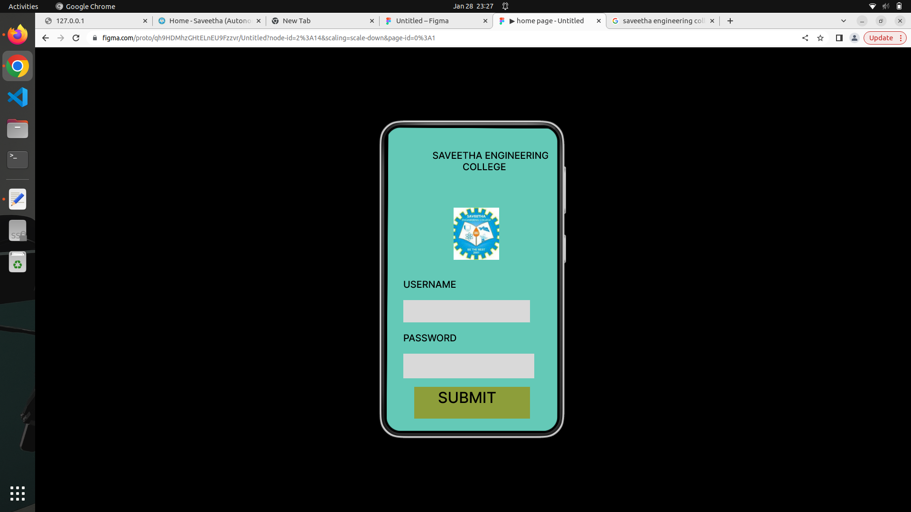
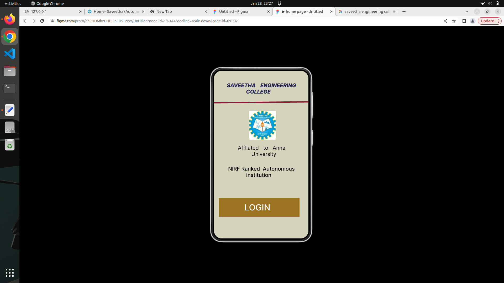
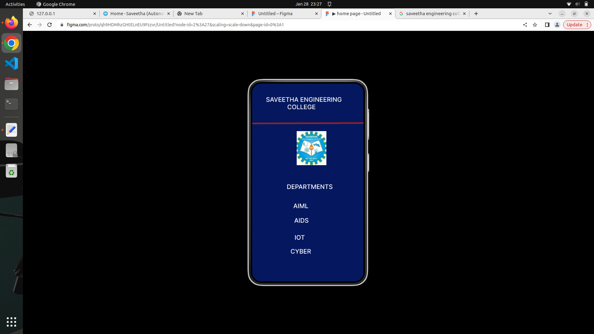

# Event Registration Web Application

## AIM:
To design, develop and deploy a web application for event registration

## DESIGN STEPS:

### Step 1:
create a new frame

### Step 2:
select any one preset size of your choice

### Step 3:
select shapes you need

### Step 4:
import images as neeeded

### Step 5:
create pages based on your need and link them

### Step 6:

Validate the HTML and CSS code.

### Step 6:

Publish the website in the given URL.

## DESIGN:
event registration

## PROGRAM:

/* home page */

position: absolute;
width: 426px;
height: 77px;
left: 29px;
top: 41px;

font-family: 'Inter';
font-style: italic;
font-weight: 800;
font-size: 26px;
line-height: 31px;

color: #232252;
position: absolute;
width: 476.03px;
height: 0px;
left: -0.01px;
top: 122.5px;

border: 5px solid #8B1B36;
transform: rotate(-0.54deg);
position: absolute;
width: 100px;
height: 110px;
left: 175px;
top: 153px;

background: url(image.png);
position: absolute;
width: 410px;
height: 97px;
left: 29px;
top: 326px;

font-family: 'Inter';
font-style: normal;
font-weight: 500;
font-size: 32px;
line-height: 39px;

color: #000000;
position: absolute;
width: 398px;
height: 76px;
left: 57px;
top: 465px;

font-family: 'Inter';
font-style: normal;
font-weight: 500;
font-size: 32px;
line-height: 39px;

color: #000000;
position: absolute;
width: 323px;
height: 71px;
left: 58px;
top: 606px;

background: rgba(156, 114, 32, 0.99);
position: absolute;
width: 323px;
height: 71px;
left: 58px;
top: 606px;

background: rgba(156, 114, 32, 0.99);

*/login page*/

position: absolute;
width: 459px;
height: 82px;
left: 39.72px;
top: 46.97px;

font-family: 'Inter';
font-style: normal;
font-weight: 500;
font-size: 32px;
line-height: 39px;

color: #000000;
position: absolute;
width: 364px;
height: 76px;
left: 89.72px;
top: 393.97px;

background: #D9D9D9;

position: absolute;
width: 364px;
height: 70px;
left: 89.72px;
top: 615.97px;

background: #D9D9D9;

position: absolute;
width: 213px;
height: 45px;
left: 84.72px;
top: 318.97px;

font-family: 'Inter';
font-style: normal;
font-weight: 500;
font-size: 32px;
line-height: 39px;

color: #000000;

position: absolute;
width: 230px;
height: 45px;
left: 86.72px;
top: 528.97px;

font-family: 'Inter';
font-style: normal;
font-weight: 500;
font-size: 32px;
line-height: 39px;

color: #000000;

position: absolute;
width: 244px;
height: 67px;
left: 144.72px;
top: 753.97px;

background: rgba(148, 150, 37, 0.85);

position: absolute;
width: 141px;
height: 39px;
left: 174.72px;
top: 775.97px;

font-family: 'Inter';
font-style: normal;
font-weight: 500;
font-size: 32px;
line-height: 39px;
/* identical to box height */

color: #000000;

position: absolute;
width: 96px;
height: 110px;
left: 218.72px;
top: 168.97px;

background: url(image.png);

*/ SEC page*/

position: absolute;
width: 534px;
height: 0px;

border: 5px solid #95207B;

position: absolute;
width: 472px;
height: 90px;
left: 32px;
top: 40px;

font-family: 'Inter';
font-style: normal;
font-weight: 500;
font-size: 32px;
line-height: 39px;

color: #FFFFFF;

position: absolute;
width: 529px;
height: 0px;
left: 0px;
top: 132px;

border: 5px solid #942323;
transform: rotate(-0.22deg);

osition: absolute;
width: 96px;
height: 110px;
left: 224px;
top: 168px;

background: url(image.png);

osition: absolute;
width: 367px;
height: 71px;
left: 90px;
top: 360px;

font-family: 'Inter';
font-style: normal;
font-weight: 500;
font-size: 48px;
line-height: 58px;

color: #FFFFFF;

position: absolute;
width: 145px;
height: 47px;
left: 175px;
top: 470px;

font-family: 'Inter';
font-style: normal;
font-weight: 500;
font-size: 48px;
line-height: 58px;

color: #FFFFFF;

position: absolute;
width: 130px;
height: 55px;
left: 190px;
top: 582px;

font-family: 'Inter';
font-style: normal;
font-weight: 500;
font-size: 48px;
line-height: 58px;

color: #FFFFFF;

position: absolute;
width: 162px;
height: 45px;
left: 145px;
top: 664px;

font-family: 'Inter';
font-style: normal;
font-weight: 500;
font-size: 48px;
line-height: 58px;

color: #FFFFFF;

position: absolute;
width: 197px;
height: 65px;
left: 145px;
top: 777px;

font-family: 'Inter';
font-style: normal;
font-weight: 500;
font-size: 48px;
line-height: 58px;

color: #FFFFFF;

## OUTPUT:

## Result:
The program to design, develop and deploy a web application for event registration is completed successfully.

